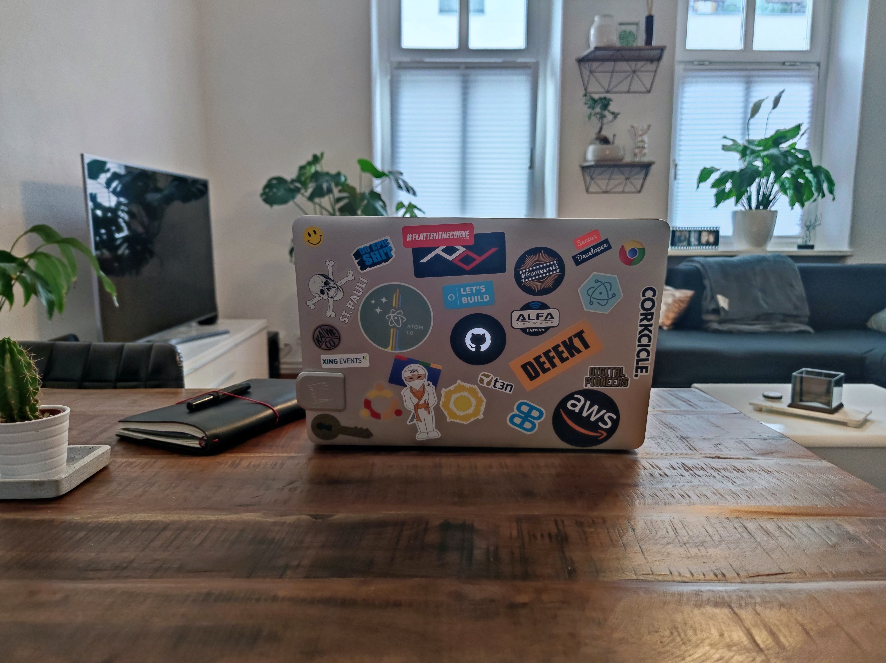

<!--truncate-->

<head>
  <meta name="twitter:image" content="./image.jpg"/>
</head>

Self-host open-source AI models on AWS with Prem and build your first AI-powered application



### What is Prem?

Prem is a self-hosted AI platform that allows you to test and deploy open-source AI models on your own infrastructure. Prem is open-source and free to use. You can learn more about Prem [here](https://premai.io).

## Install Prem on AWS

### What to expect

The end goal is to create a Perplexity AI clone entirely open-source, using Llama 2 from Meta as LLM of choice and the **fantastic** open-source frontend [Clarity AI](https://github.com/mckaywrigley/clarity-ai) built by [Mckay Wrigley](https://github.com/mckaywrigley). We already wrote about [how to make a self hosted Perplexity AI clone here](../2023-07-01-perplexity-ai-self-hosted/index.md), but now let's do it with AWS!

### Step 1: Install Prem on AWS

Create a AWS account if you don't have one already, then login to the [AWS Console](https://console.aws.amazon.com/).

#### 1. Launch an instance

For convenience, we prepared an `AMI` with already NVIDIA Toolkit installed, along with Docker and Docker Compose.

🔗 [ami-06d4672384794fa01](https://console.aws.amazon.com/ec2/v2/home#LaunchInstanceWizard:ami=ami-06d4672384794fa01)

- **Name**: `prem-demo`
- **Image**: `ami-06d4672384794fa01`
- **Instance type**: `g5.48xlarge`
- **Security Groups**: Add Inbound Rule for the Port range `8000` with Source `0.0.0.0/0`
- **Storage**: min `128 GB`

Click on **Launch Instance**

#### 2. Connect to the instance via SSH

```bash
ssh ubuntu@<your-instance-ip>
```

#### 3. Install Prem

```bash
wget -q https://get.prem.ninja/install.sh -O install.sh; sudo bash ./install.sh
```

#### 4. Check the app

Visit the following URL in your browser: `http://<your-instance-ip>:8000` to confirm the Prem App is up and running.

### Step 3: Download the model 

From the Prem App, select the `Llama V2 13B Chat` model and click on the **dowload** icon.
This can take a while, so grab an espresso ☕️

### Step 4: Run the model and the app

Once the model is downloaded, click **Open** button. This will start the container and open the chat UI. At this point we don't need the embedded user interface, so we can close it.

Now back to the frontend, let's run it locally and connect to our Prem instance.

#### 1. Set the right environment variable 

```bash
export NEXT_PUBLIC_API_URL=http://<your-instance-ip>:8000
```

#### 2. Install the dependencies

```bash
npm install
```

#### 3. Run the frontend

```bash
npm run dev
```


### Enjoy!

Visit the following URL in your browser: `http://localhost:3000` to start using your own Perplexity AI clone!

